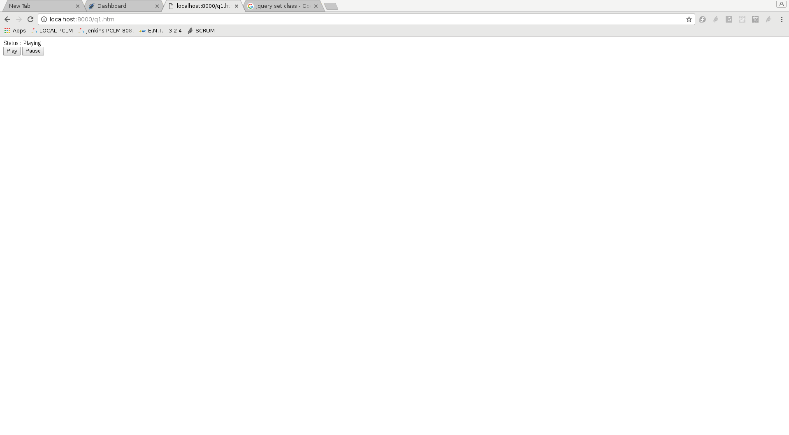
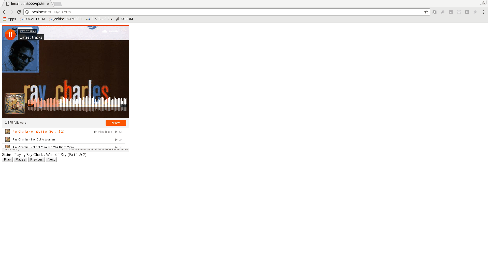
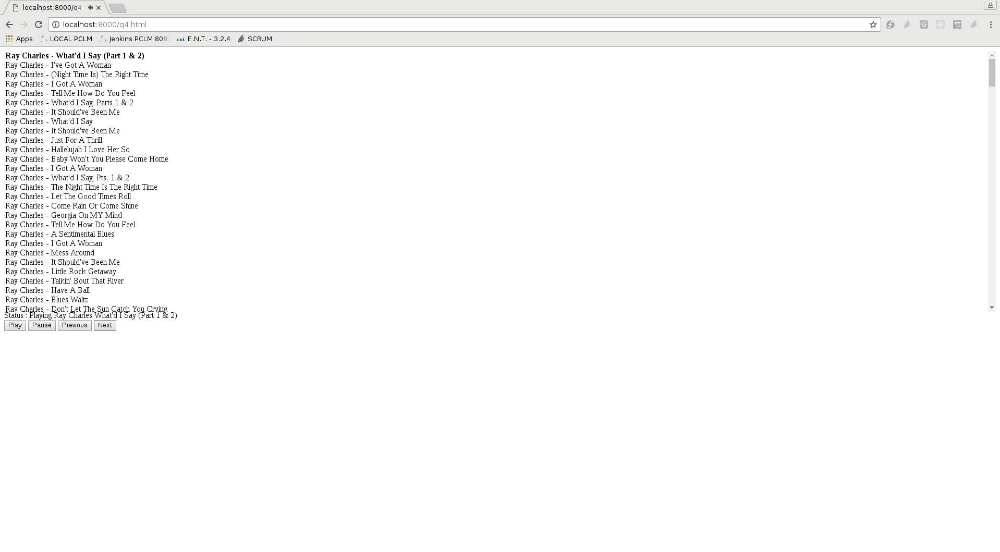
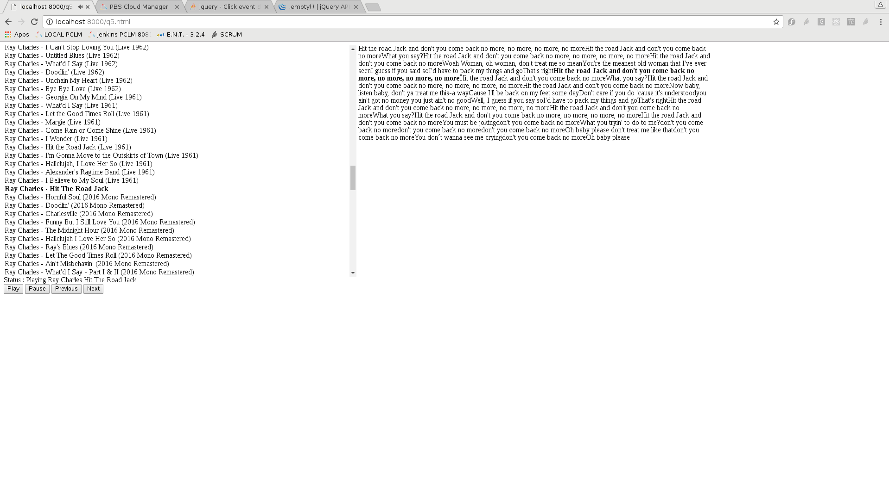

TP 2
====

### A lire attentivement avant de commencer

Le but de ce TP est d'appliquer les concepts vus en cours.

Les TPs se font seuls ou par équipe de deux personnes. Tous les élèves de l'équipe doivent participer (taper au clavier, réfléchir aux exercices).

Chaque question doit être traitée en apportant en réponse le code souhaité ainsi qu'un texte explicatif si nécessaire. Le format du fichier de réponse et le code nécessaire au fonctionnement du programme. Par exemple, pour la question 1, on crée un fichier `question1.html`.

Si il faut rajouter des explications, créer un simple `.txt`, unique pour votre TP, formatté en markdown.

Le but de ce TP est de s'entrainer à utiliser JQuery pour faciliter l'accès au DOM et s'entraîner avec l'ajax (fetch)

On utilisera pour ce TP jQuery 3.1 , que vous pouvez récupérer ici : https://code.jquery.com/jquery-3.1.1.js

Dans tout les exercices, on s'interdira d'utiliser des ids pour identifier des éléments dans le DOM : Le problème avec l'utilisation d'ids est simplement que cela peut entrainer des conflits si vous placez plusieurs composants sur la même page.

On fera également attention à limiter le scope de jQuery, c'est à dire que chacun des sélecteurs jQuery ne devra cibler uniquement des éléments qui sont contenu dans un div.container.

On utilisera également toujours un modèle pour représenter nos données, plutôt que d'utiliser le DOM comme source de données.

Cela signifie qu'une seule fonction doit faire des modifications dans le DOM, qu'on appelera simplement renderModel();

<div class="container">
</div>

Question 1
----------

```
var model = [
	status: "Playing",
	songs: [
		{artist: "Ray Charles", song: "Georgia On My Mind"},
		{artist: "Sarah Vaughan", song: "What a Difference a Day Makes"}
	],
	songIndex: 0
];
```

Le but est d'écrire une interface pour lire de la musique.

On commence d'abord par créer deux boutons, un bouton play et un bouton pause, qui permettent de changer l'état de lecture (le status du model), et affiche un retour visuel.



Question 2
----------

Le but est d'intégrer le lecteur de soundcloud, on commence tout d'abord par ajouter le lecteur soundcloud en JS.

Il faut d'abord récupérer un iframe :

Allez sur https://soundcloud.com/raycharles (ou autre artiste) et dans share/embed, copiez l'iframe.

L'API JS de Soundcloud est décrite ici :

https://developers.soundcloud.com/docs/api/html5-widget#methods

On souhaite ne pas afficher l'UI de base de soundcloud, mais faire notre propre interface (libre à vous de rajouter le style que vous souhaitez).

On souhaite que le lecteur démarre directement au chargement de la page, et que les boutons play et pause fonctionnent.

Astuces :

Il faudra utiliser :

-	widget.bind();
-	widget.play();
-	widget.pause();
-	SC.Widget.Events.READY


Question 3
----------

Ajoutez les boutons prev, next, qui permettent de changer de titre.

On fera attention à ce que si le statut du player est "Paused", et que l'on clique sur "Next" ou "Previous", le statut repasse à Playing.

Faites également en sorte que le titre et l'artiste en cours s'affiche.



Question 4
----------

Faites en sorte que l'on affiche la liste des chansons, et que l'on puisse directement cliquer sur n'importe quelle chanson pour la lire.

On n'utilisera ici pas de fonction qui fait un setHTML(string).

Les fonctions interdites sont donc $().html(), mais également créer le DOM à partir d'un gros string.

On peut par exemple créer un tr en jquery avec $("<tr></tr>")

et ensuite appeler la méthode .text("Text") pour setter un texte.

La chanson en cours doit apparaitre en gras.



Question 5
----------

Le but est de faire en sorte de récupérer les Lyrics de la chanson en cours, et qu'on surligne au fur et à mesure de l'avancée de la chanson les lyrics en cours.

On doit également pouvoir cliquer sur le texte de la chanson, et le lecteur nous place alors directement au bon endroit dans la chanson.

Pour cela, on utilise le fichier song.json, que vous pouvez récupérer sur cette page : [song.json](song.json)

On utilisera $.ajax pour fetcher ces données.

http://opendata.stackexchange.com/questions/3993/music-lyrics-timing-data



Questions bonus
---------------

Ces questions ramènent des points seulement si toutes les autres questions sont traitées.

-	Faire en sorte que il y ait plusieurs fichiers de sous-titre, et que ces fichiers soient chargés au moment ou l'on clique sur une chanson.
-	Rendre le style du lecteur plus joli.
-	Demander à l'utilisateur quelle playlist il souhaite jouer.
